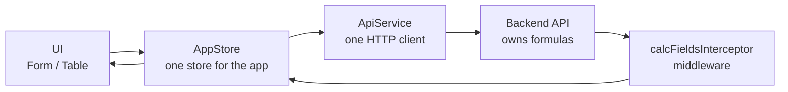
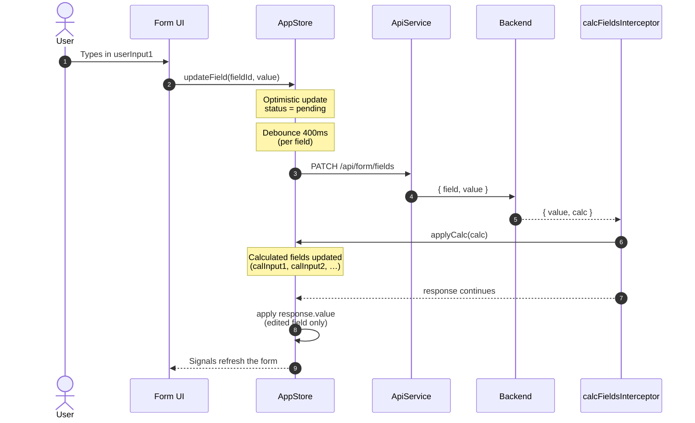
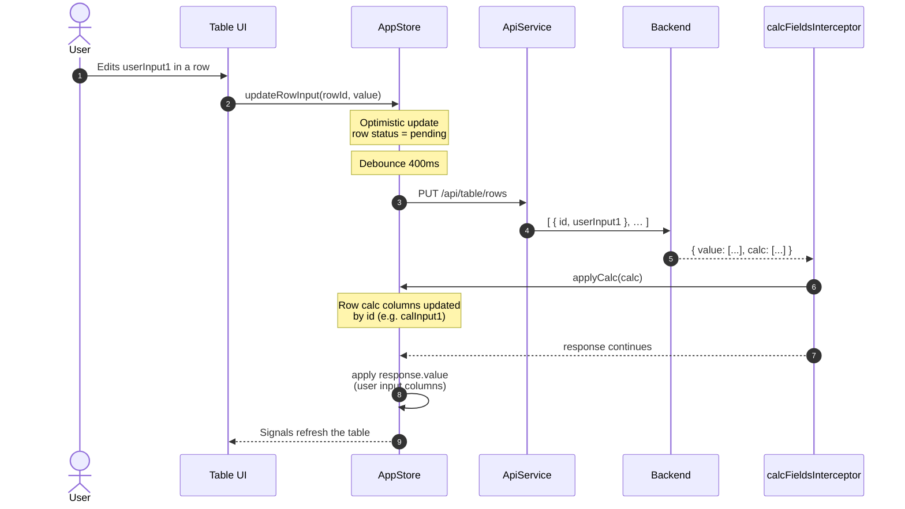
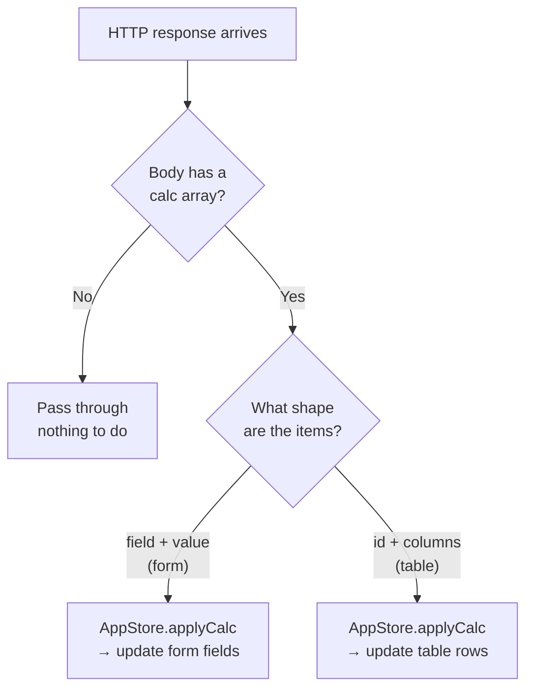

# Calculated Fields POC

A customer-facing proof of concept that shows how **editable inputs** and **backend-driven calculated fields** stay in sync — for both a simple form and a multi-row table — without putting calculation logic in the browser.

---

## Why this approach

In the legacy Delphi desktop form, calculated values were tightly coupled to the UI. This POC demonstrates a cleaner, web-ready pattern:

1. **The server owns the formulas.** The browser never recalculates business rules.
2. **One application store** holds form fields and table rows so the UI always reads from a single source of truth.
3. **One HTTP interceptor** watches every API response. If the response includes a `calc` array, the interceptor updates the store automatically — no matter which screen triggered the request.
4. **Optimistic UI + debounce** keeps typing feeling instant while avoiding a request on every keystroke.

That combination makes calculated fields **consistent**, **reusable across screens**, and **easier to evolve** when business rules change on the backend.

---

## What you can try in the demo

| Screen | What it shows |
|--------|----------------|
| **Form** | Single fields: normal inputs, read-only calculated fields, and overridable calculated fields |
| **Table** | Row-based editing via a PUT of the full value array; calculated columns update from a row-shaped `calc` response |

Open the browser console to watch `[AppStore] state` as values change.

---

## Field types (human terms)

| Kind | What the user sees | Who sets the value |
|------|--------------------|--------------------|
| **normal** | Editable input | User types → API confirms |
| **calculated** | Read-only | Only the API `calc` array |
| **calculated-overridable** | Editable, but starts as a calculated value | User may override; **Clear** sends `null` and the server recalculates |

---

## Architecture at a glance



| Piece | Role in plain language |
|-------|------------------------|
| **UI components** | Capture typing and show the latest store values |
| **AppStore** | Holds form fields + table rows; applies the user’s edited `value` |
| **ApiService** | Talks to the backend (`GET` / `PATCH` / `PUT`) |
| **calcFieldsInterceptor** | After every successful response, if `calc` is present, pushes those values into the store |
| **Backend** | Validates input, runs formulas, returns `value` + `calc` |

---

## How an input update flows (with interceptor)

When a user changes a field, two different parts of the response are handled in two different places on purpose:

- **`value`** → applied by the store method that made the request (the field or row the user edited)
- **`calc`** → applied by the interceptor (any dependent calculated fields / columns)

That split keeps calculation sync **universal**: any future screen that calls the API gets `calc` handling for free.

### Form field update (PATCH one field)



**In short:** type → store updates immediately → wait briefly → PATCH → interceptor fills calculated fields → store confirms the edited field.

### Table cell update (PUT value array)



**In short:** edit a cell → store updates the row → debounced PUT of the full array → interceptor applies row-shaped `calc` → store applies confirmed `value` rows.

### What the interceptor looks for



Example **form** calc item: `{ "field": "calInput1", "value": 20 }`  
Example **table** calc item: `{ "id": 1, "calInput1": 20 }`

---

## Performance and scalability

This section is meant for technical and business stakeholders evaluating the approach for production use.

### Pros

| Area | Benefit |
|------|---------|
| **Fewer wasted requests** | 400ms debounce + per-field grouping means rapid typing produces one PATCH/PUT, not one per keystroke |
| **In-flight cancellation** | `switchMap` drops outdated requests for the same field when the user keeps typing |
| **Feels fast** | Optimistic updates refresh the UI before the network round-trip finishes |
| **Single calc pipeline** | One interceptor + one `applyCalc` path means new screens inherit calc sync without duplicating logic |
| **Server-side formulas** | Heavy or regulated calculation logic stays on the backend; the client stays thin and consistent across devices |
| **Predictable state** | One store reduces “which component owns this value?” bugs as the app grows |
| **Partial calc payloads** | Backend can return only changed calc entries, keeping response size smaller as forms grow |

### Cons / trade-offs

| Area | Trade-off | When it matters |
|------|-----------|-----------------|
| **Network dependency** | Every meaningful change needs the API for correct calc results | Offline / high-latency environments need extra design (cache, queue, or local preview rules) |
| **Interceptor on all HTTP** | Middleware inspects every response for a `calc` array | Cost is tiny (shape check), but noisy APIs should keep unrelated payloads free of a `calc` key |
| **Full-array table PUT** | Current table demo sends the whole editable array | Fine for small/medium grids; large grids (hundreds+ rows) should move to row-level or patch-style APIs |
| **Single store growth** | One store is simple for this POC | Very large domains may later split by feature *while keeping the same interceptor pattern* |
| **Optimistic vs server truth** | UI may briefly show a value the server rejects | Need clear error status (already shown per field/row) and optional rollback strategies |
| **Chatty forms at scale** | Many independent fields still mean many PATCH calls if users edit widely | Mitigate with batch endpoints, coarser save actions, or server push for bulk recalculation |

### Scalability guidance

| Scale | Recommendation with this pattern |
|-------|----------------------------------|
| **Small forms / short tables** (this POC) | Current design is a strong fit: debounce + interceptor + single store |
| **Large tables** | Keep interceptor/`calc` contract; change transport to PATCH-one-row or PATCH-changed-rows instead of full-array PUT |
| **Many concurrent users** | Backend remains the bottleneck for formulas — scale API/compute, not the Angular client |
| **Complex dependency graphs** | Prefer backend returning only affected `calc` entries; client already merges by field id / row id |
| **Multiple apps / channels** | Same `value` + `calc` contract can be reused by web, mobile, or integrations |

**Bottom line for the pitch:** the pattern scales well in *architecture* (one calc middleware, server-owned rules). Network payload shape should evolve with table size, but the store/interceptor model does not need to be thrown away.

---

## Customer value summary

- **Business rules stay centralized** — change a formula once on the server; every UI updates the same way.
- **Consistent UX** — calculated fields refresh automatically after any qualifying API response.
- **Lower frontend risk** — no duplicated Delphi/web formulas drifting apart.
- **Clear audit path** — what the user typed (`value`) and what the system calculated (`calc`) are explicit in the API contract.
- **Ready to extend** — form today, table tomorrow, other screens later, same interceptor and store entry point.

---

## Run the POC

```bash
npm install
npm start
```

Open http://localhost:4200/.

Ensure the backend API is running and reachable at the URL in `src/environments/environment.development.ts` (default `https://localhost:7161`).

### Redux DevTools (optional, for demos)

1. Install the [Redux DevTools](https://chrome.google.com/webstore/detail/redux-devtools/lmhkpmbekcpmknklioeibfkpmmfibljd) Chrome extension.
2. Open the app → Chrome DevTools → **Redux** / **NgRx Signal Store**.
3. Inspect the `app` store. Actions look like `[App] updateField success (userInput1)` or `[App] applyCalc (rows)`.

---

## Where things live

| Piece | Path |
|-------|------|
| Application store (form + table) | `src/app/store/app.store.ts` |
| HTTP API client | `src/app/services/api.service.ts` |
| Calc interceptor (middleware) | `src/app/interceptors/calc-fields.interceptor.ts` |
| Form field models | `src/app/models/form-field.model.ts` |
| Table row models | `src/app/models/table-row.model.ts` |
| Form UI | `src/app/components/calculated-form/` |
| Table UI | `src/app/components/calculated-table/` |
| Backend table API prompt | `docs/backend-table-api-prompt.md` |
| Environments | `src/environments/environment*.ts` |

---

## Initialization

On startup the store loads both surfaces:

1. **`GET /api/form`** → populates form fields (`value`, `kind`, `isOverridden`)
2. **`GET /api/table`** → populates table rows (`id`, inputs, calculated columns)

There are no hardcoded business values in the frontend.

---

## API contracts

### Form — load

```http
GET /api/form
```

```json
{
  "fields": [
    { "field": "userInput1", "kind": "normal", "value": 0 },
    { "field": "userInput2", "kind": "normal", "value": 0 },
    { "field": "calInput1", "kind": "calculated", "value": 0 },
    { "field": "calInput2", "kind": "calculated-overridable", "value": 5, "isOverridden": false }
  ]
}
```

### Form — update one field

```http
PATCH /api/form/fields
Content-Type: application/json

{ "field": "userInput1", "value": 10 }
```

```json
{
  "value": { "field": "userInput1", "value": 10 },
  "calc": [
    { "field": "calInput1", "value": 20 },
    { "field": "calInput2", "value": 30 }
  ]
}
```

Send `"value": null` to clear an override on a calculated-overridable field.

### Table — load

```http
GET /api/table
```

```json
{
  "rows": [
    { "id": 1, "userInput1": 10, "calInput1": 20 },
    { "id": 2, "userInput1": 20, "calInput1": 20 },
    { "id": 3, "userInput1": 30, "calInput1": 30 }
  ]
}
```

### Table — update value array

```http
PUT /api/table/rows
Content-Type: application/json

[
  { "id": 1, "userInput1": 10 },
  { "id": 2, "userInput1": 20 },
  { "id": 3, "userInput1": 30 }
]
```

```json
{
  "value": [
    { "id": 1, "userInput1": 10 },
    { "id": 2, "userInput1": 20 },
    { "id": 3, "userInput1": 30 }
  ],
  "calc": [
    { "id": 1, "calInput1": 20 },
    { "id": 2, "calInput1": 20 }
  ]
}
```

---

## Backend URL

Set `apiBaseUrl` (no trailing slash) in:

- `src/environments/environment.development.ts` — used by `ng serve`
- `src/environments/environment.ts` — used by production builds

Current default: `https://localhost:7161`

---

## Stack

- Angular 19 (standalone components)
- `@ngrx/signals` (`signalStore`, `withState`, `withMethods`, `rxMethod`)
- `@angular-architects/ngrx-toolkit` (`withDevtools`, `updateState`) for Chrome Redux DevTools
- Angular `HttpClient` + functional interceptor for universal `calc` handling
